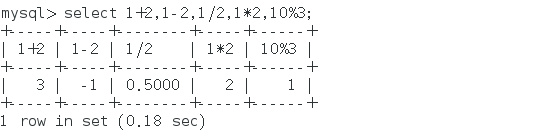
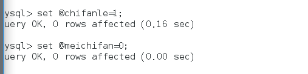
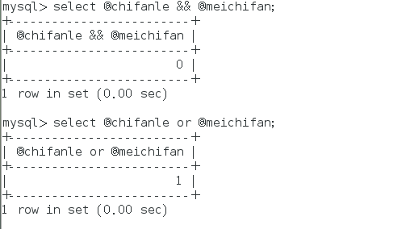

mysql    

## 实际案例见：https://www.runoob.com/mysql/mysql-operator.html

### 1.算术运算符

```mysql
+  加法运算
-  减法运算
*  乘法运算
/  除法运算
div 求商如果除数为0，返回null
%或mod  取模  求余数
在除法运算和模运算中，如果除数为0，将是非法除数，返回结果为NULL
```



### 2.比较运算符

```mysql
=   	 	等于	  0判断值是否相等，相等返回1，反之为0
<>或!=   	不等于  判断值是否不相等，不相等返回1，反之为0
>		    大于
<		    小于
<=			小于等于
>=			大于等于
between		在两值之间    格式： 值1 between 值2 and 值3 值1是否在值2到值3之间（值2值3按从小到大来写） 在其中返回1，反之为0
not between	不在两值之间  格式： 值1 not between 值2 and 值3 值1是否不在值2到值3之间（值2值3按从小到大来写） 不在其中返回1，反之为0
in			在集合中	格式： 值 in （值1，值2 ....）   如果定义的值中有null，则直接返回null
not in 		不在集合中	格式： 值 not in （值1，值2 ....）
<=>			严格比较两个null值是否相等      两个操作码都为null时，其所得值为1，其中一个为null时，所得值为0.
like   		模糊匹配   与%和_下划线混杂着使用 %代表多个字符，_代表多个字符。
regexp或rlike 正则式匹配	
		1^：用于匹配以什么开头的字符串。
		2$:用于匹配以什么结尾的字符串
		3.：用于匹配任意一个单个字符串
		4[…]:用于匹配在方括号中的任意字符
		5*：用于匹配零个或多个在它前面的字符


is null 	 为空       判断值是否为空，为空返回1，反之为0 格式：值 is null
is not null  不为空
least		当有两个或多个参数时，返回最小值  格式：least（值1，值2 ....） 
greaest      当有两个或多个参数时，返回最大值  格式:greatest(值1，值2 ....)


注意：在 SQL 语言中，所有逻辑运算符求值所得的结果均为 TRUE、FALSE 或 NULL。在 MySQL 中分别体现为 1（TRUE）、0（FALSE）和 NULL。

```

### 3.逻辑运算符

```mysql
not 或 ！	   逻辑非    表示当操作数为 0 时，返回值为 1；当操作数为非零值时，返回值为 0；当操作数为 NULL 时，返回值为 NULL。

and 或 &&  	逻辑与     表示当所有操作数均为非零值并且不为 NULL 时，返回值为 1；当一个或多个操作数为 0 时，返回值为 0；其余情况返回值为 NULL。

or  或 ||	逻辑或     表示当两个操作数均为非 NULL 值且任意一个操作数为非零值时，结果为 1，否则结果为 0；当有一个操作数为 NULL 且另一个操作数为非零值时，结果为 1，否则结果为 NULL；当两个操作数均为 NULL 时，所得结果为 NULL。


xor			逻辑异或   当任意一个操作数为 NULL 时，返回值为 NULL；对于非 NULL 的操作数，若两个操作数都不是 0 或者都是 0 值，则返回结果为 0；若一个为 0，另一个不为非 0，则返回结果为 1。

逻辑非 ：判断操作数是否为0，为0返回1，不为0返回0
逻辑与：同真为真，一假为假，同假为假
逻辑或：一真为真，一假一真为真，同假为假
逻辑异或：童真同假为假，一真一假为真
```

案例





### 4.位运算符

```mysql
| 	按位或  位或运算的实质是将参与运算的两个数据按对应的二进制数逐位进行逻辑或运算。若对应的二进制位有一个或两个为 1，则该位的运算结果为 1，否则为 0

& 	按位与  位与运算的实质是将参与运算的两个数据按对应的二进制数逐位进行逻辑与运算。若对应的二进制位都为 1，则该位的运算结果为 1，否则为 0。

^ 	按位异或 位异或运算的实质是将参与运算的两个数据按对应的二进制数逐位进行逻辑异或运算。对应的二进制位不同时，对应位的结果才为 1。如果两个对应位都为 0 或者都为 1，则对应位的结果为 0。

<< 	按位左移 位左移运算符“<<”使指定的二进制值的所有位都左移指定的位数。左移指定位数之后，左边高位的数值将被移出并丢弃，右边低位空出的位置用 0 补齐。

>> 	按位右移 位右移运算符“>>”使指定的二进制值的所有位都右移指定的位数。右移指定位数之后，右边高位的数值将被移出并丢弃，左边低位空出的位置用 0 补齐。


~ 	按位取反，反转所有比特    位取反运算符的实质是将参与运算的数据按对应的二进制数逐位反转，即 1 取反后变 0，0 取反后变为 1   
按最大显示2^64来显示所以   0取反为   018446744073709551615
```


##### 注意：不同运算符的优先级是不同的。一般情况下，级别高的运算符优先进行计算，如果级别相同，MySQL 按表达式的顺序从左到右依次计算。 另外，在无法确定优先级的情况下，可以使用圆括号“()”来改变优先级，并且这样会使计算过程更加清晰。 

