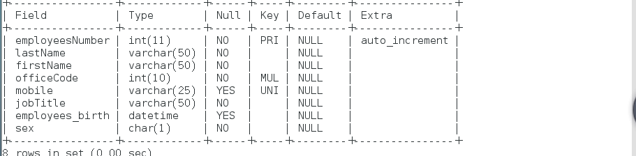

作业:

1.创建数据库company


2.创建表offices和employees

```mysql
创建表offices
create table offices(officeCode int(10) primary key not null unique,city int(11) not null ,address varchar(50),country varchar(50),postalCode varchar(25) unique );

创建表employees
create table employees(employeesNumber int(11) primary key  not null unique auto_increment , lastName varchar(50) not null, firstName varchar(50) not null,mobile varchar(25) unique, officeCode int(10) not null,jobTitle varchar(50) not null , brith datetime not null , note varchar(255), sex varchar(5), constraint fs_1 foreign key (officeCode) references offices(officeCode));

```


3.将employee的mobile字段修改到officeCode字段后面

```mysql
alter table employees modify mobile varchar(25) after officeCode;
```


4.将表employees的birth字段改名为employees_birth

```mysql
alter table employees change brith employees_birth datetime  ;
```


5、修改sex字段，数据类型为CHAR(1)，非空约束

```
alter table employees modify sex char(1) not null;
```


6、删除字段note

```
 alter table employees drop note;
```



7、添加字段名favorite_activity，数据类型为VARCHAR(100)

```
 alter table employees add favorite_activity varchar(100);
```


8、删除表offices

```
先去除相对应的外键约束，然后再删除表
alter table employees drop foreign key fs_1;
drop table if exists offices;
```


9、修改表employee存储引擎为MyISAM

```
alter table employees ENGINE='MyISAM';
```


10、将表employees名称修改为employee_info

```
 alter table employees rename employees_info;
```


