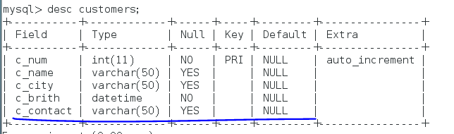
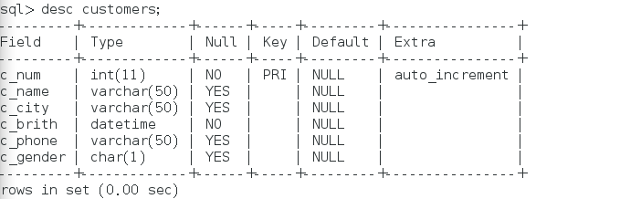
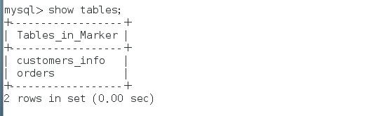
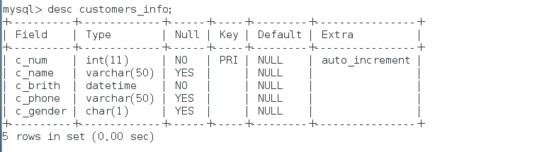
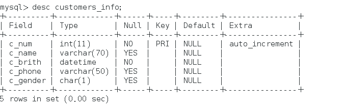
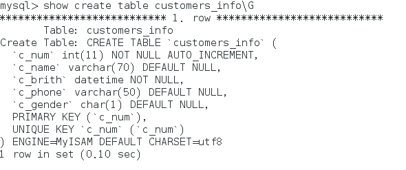
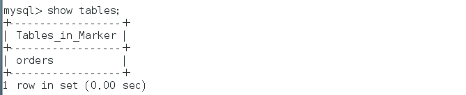

customers表

1.创建数据库Marker

```mysql 
 create database Marker;
 use Marker;
```

2.创建表customers，在c_num字段上添加主键约束和自增约束，在c_birth字段上添加非空约束

```mysql
create table customers(c_num int(11) primary key not null unique auto_increment,c_name varchar(50),c_contact varchar(50),c_city varchar(50),c_brith datetime not null);
```

3.将c_contact字段插入到c_birth后面

```mysql
alter table customers modify c_contact varchar(50) after c_brith;
```



4.将c_contact字段名改为c_phone

```mysql
alter table customers change c_contact c_phone varchar(50);
```


5.添加c_gender字段，数据类型为CHAR(1)

```mysql
alter table customers add c_gender char(1);
```



6.将表名修改为customers_info

```mysql
alter table customers rename customers_info;
```



7.删除字段c_city

```mysql
 alter table customers_info drop c_city;
```



8.将c_name字段数据类型改为VARCHAR(70)

```mysql
alter table customers_info modify c_name varchar(70);
```



9.修改数据表的引擎为MyISAM

```mysql
 alter table customers_info ENGINE=MyISAM;
```



orders表

1.创建表orders，在o_num字段上添加主键约束和自增约束，在c_id字段上添加外键约束，关联chustomers

```mysql
因为第一张表的存储引擎MyISAM不支持外键，所以想要添加外键先把第一张表的存储引擎改到InnoDB。
create table orders(o_num int(11) primary key not null unique auto_increment, o_date date,c_id int(11), constraint fs_ee1 foreign key (c_id) references customers_info(c_num));
```

2.删除orders表的外键约束，然后删除表customers

```mysql
alter table orders drop foreign key fs_ee1;
drop table customers_info;

```

