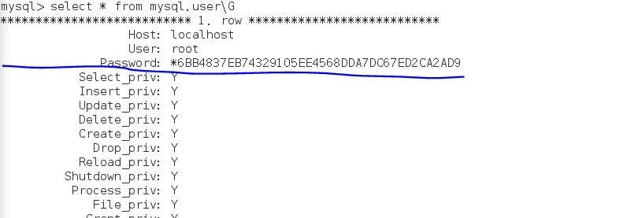

## mysql权限

​																	用户与权限

```mysql
##查看用户权限
select  * from mysql.user\G
```



在mysql库中有个user表，用来记录用户的身份和权限，其中user，host，password散列分别对用用户名、主机、密码，其中主机名和用户作为联合主键用来保证用户的唯一性，当登录mysql时，只有匹配了user表中的user，host，password才允许登录，mysql把以上三种内容称之为---用户列。


```
select * from information_schema.tables\G
```


### 权限列;

允许用户在给定的权限范围内，做允许该用户执行的操作，所有priv结尾的字段均为权限，如果该用户拥有该权限为y，没有为N，权限用户保证数据库的安全性而存在。

所有权限列的字段，数据类型为enum枚举，他的范围是y或者n，要么有权限，要么没权限，不存在不确定的情况，切一次只能在两个选择其中的一个，作为结果。

```mysql
           Select_priv: Y		#查询权限
           Insert_priv: Y		#插入权限	 
           Update_priv: Y		#更新权限
           Delete_priv: Y		#删除表权限
           Create_priv: Y		#创建权限
             Drop_priv: Y		#删除库或者表权限
           Reload_priv: Y		#重载权限  （使用flush  privileges的权限）
         Shutdown_priv: Y		#关闭进程权限  （关闭数据库的权限）
          Process_priv: Y		#查看进程权限
             File_priv: Y		#文件权限
            Grant_priv: Y		#给其他用户授权权限  
       References_priv: Y		#操作约束条件权限
            Index_priv: Y		#索引权限
            Alter_priv: Y		#修改权限
          Show_db_priv: Y		#查看数据库权限
            Super_priv: Y		#超级权限
 Create_tmp_table_priv: Y		#创建临时表权限
      Lock_tables_priv: Y		#锁表权限
          Execute_priv: Y		#执行函数或者存储过程权限
       Repl_slave_priv: Y		#复制权限（查看主从的权限）
      Repl_client_priv: Y		#管理slave权限
      Create_view_priv: Y		创建视图权限
        Show_view_priv: Y		查看试图权限
   Create_routine_priv: Y		创建函数或者存储过程权限
    Alter_routine_priv: Y		修改函数或者存储过程权限
      Create_user_priv: Y		创建用户的权限
            Event_priv: Y		事件权限
          Trigger_priv: Y		触发器权限
Create_tablespace_priv: Y		创建表空间权限  

```

查看当前登录的用户信息

```mysql
show  processlist
```

#### 创建表空间


```
frm表结构文件

以myi结尾的文件使用myisam存储引擎去存放索引信息的文件

以myd结尾的文件使用myisam存储引擎存放表数据的文件
```


### 安全列

安全咧用于保证mysql用户的安全性，包含两个ssl开头的字段，用于加密，两个x509开头的字段，用于验证用户的身份，如果是空的，表示mysql以内验证用户身份的机制（用户，主机，密码） ，authentication_string在5.7版本后用于存放用户密码，代替password字段，plugin验证用户身份的插件字段


### 如何创建用户

```
1、create user 创建用户

create user 用户名@主机名 【identified  by [password] 'password'】;
##生成的密码hash值；
select password('321.com');
+-------------------------------------------+
| password('321.com')                       |
+-------------------------------------------+
| *93F5D915C823C3215F4E2CA8797D441B9BD09088 |
+-------------------------------------------+


 create user 'cl'@'localhost' identified by password '*93F5D915C823C3215F4E2CA8797D441B9BD09088';

 

 

 2、使用grant创建用户
 grant privileges on db.table to 'user'@'host' [identified by 'password'] [,user@host [identified by 'password']][with grant option]
 privileges  表示赋予用户的权限有哪些
 db.table   表示改权限在某库的某表上拥有
 with grant option 给其他用户授权的权限
 identified by 'password' 给用户设置密码

 grant all on *.* to 'fg'@'localhost' identified by '123.com';

 grant all on *.* to 'fg'@'localhost' identified by '123.com' with grant option;

 ############create user和grant 区别在于，grant可以多次使用，如果用户不存在，创建用户，如果用户存在等于授权，还可以用来修改密码，grant还可以在创建时赋予用户权限，而create  user 不可以

 同时创建两个用户，一个为user1，一个为user2 user1：111.com ，user2：222.com。同时赋予这两个用户所有权限 
 grant all on *.* to 'user1'@'localhost' identified by '111.com', 'user2'@'localhost' identified by '222.com' with grant option;

 3、使用insert 添加用户
 使用create user 和grant创建用户实际上是向mysql库中的user表，里写入数据的过程，通过直接操作uer表，也可以写入用户，但为了安全性，尽可能的选择前两种方式创建用户。
 #插入数据之后，需要使用flush  privileges命令刷新来加载，
```

### 删除用户

```
drop user ‘user’@‘host’
直接操作user表
delete from mysql.user where 条件判断
```


#### 修改密码

```
1.使用mysql admin修改密码

 mysqladmin -u root -p123456 password 123.com
 mysql -u root -p123.com


2.直接操作user表

mysql> update mysql.user set password=password('321.com') where user='root' and host='localhost';
Query OK, 1 row affected (0.00 sec)
Rows matched: 1  Changed: 1  Warnings: 0

mysql> flush privileges;
Query OK, 0 rows affected (0.00 sec)

mysql> exit
Bye
[root@localhost sw]# mysql -u root -p321.com


3.使用set修改密码

#修改当前登录用户的密码
mysql> set password=password('123.com');
#如果拥有root权限，还能更改别人的密码
set password  for 'user2'@'localhost'=password('111.com');


4.使用grant修改密码
grant all on *.* to 'user2'@'localhost' identified by '111111';


```

##### 当执行完成跳出扫描密码操作的时候，平常修改是起不了作用的，只能用update命令来强制修改表数据，刷新命令后退出数据库后，添加密码重新登录。

